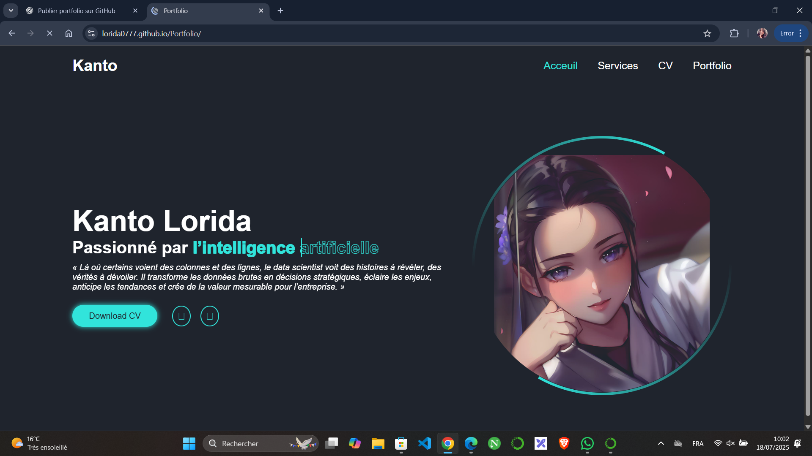

<h1 align="center">💼 Portfolio Web - Lorida</h1>

  

  Bienvenue sur mon portfolio professionnel développé avec <strong>HTML</strong>, <strong>CSS</strong> et <strong>JavaScript</strong>.  
  Ce site présente mes compétences, mes projets et mon parcours dans le domaine du développement web et de la data science.

---

## 🌐 Accès au site

🔗 **Lien direct vers mon portfolio :**  
👉 [https://lorida0777.github.io/Portfolio/](https://lorida0777.github.io/Portfolio/)

---

## 🛠️ Technologies utilisées

| Langage / Outil | Description |
|-----------------|-------------|
| `HTML5`         | Structure du site |
| `CSS3`          | Mise en forme, responsive design |
| `JavaScript`    | Dynamisme et interactions |
| `Git & GitHub`  | Versioning et déploiement avec GitHub Pages |

---

## 📸 Aperçu du site

